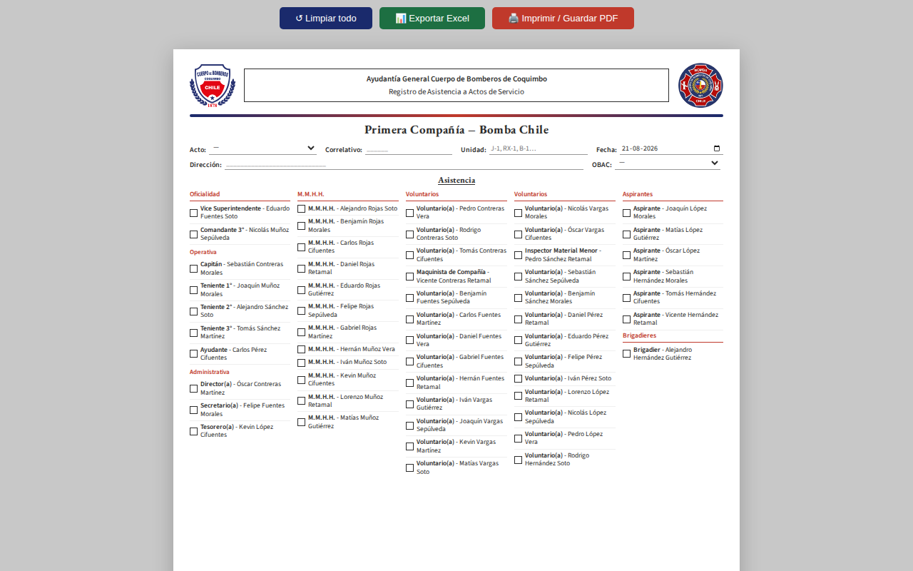
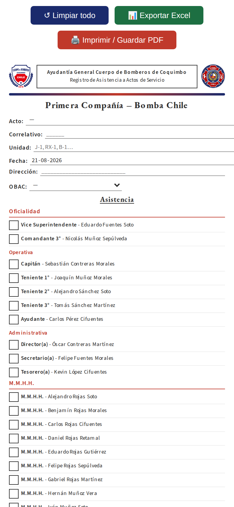

> **⛔ PROYECTO DEPRECATED** — Propuesta de digitalización del registro de
> asistencia de voluntarios. Descontinuada: la institución exige el formato
> oficial exacto para poder adoptarla; pendiente replicar ese formato digitalmente.

# Asistencia Digital — 1ª Compañía de Bomberos de Coquimbo

> ▶️ **[Demo online](https://2674321.github.io/asistencia-digital-bomberos/)** (datos de prueba)

   

Aplicación Web Progresiva (PWA) para el control de asistencia de voluntarios.

## Descripción

Sistema digital para registrar y gestionar la asistencia de voluntarios de la 1ra Compañía de Bomberos. Diseñado para funcionar tanto en línea como sin conexión a internet.

## Características

- **Registro de asistencia** de voluntarios en tiempo real
- **Funcionamiento offline** mediante Service Worker
- **Instalable** como aplicación en dispositivos móviles y de escritorio
- **Sincronización automática** cuando se restaura la conexión
- **Interfaz responsive** optimizada para todos los dispositivos

## Capturas

> Datos de prueba · capturas: agosto 2026 · v1 · [demo online](https://2674321.github.io/asistencia-digital-bomberos/)

*Vista principal — escritorio · ago 2026 · v1*

*Vista móvil (PWA instalable) · ago 2026 · v1*

## Tecnologías

- HTML5 / CSS3 / JavaScript vanilla
- Service Worker (PWA)
- JSON para almacenamiento local
- Manifest para instalación

## Archivos Principales

| Archivo | Descripción |
|---------|-------------|
| `asistencia_primera_compania_v3.html` | Aplicación principal (入口) |
| `sw.js` | Service Worker para funcionalidad offline |
| `manifest.json` | Manifest de la PWA |
| `voluntarios.json` | Base de datos local de voluntarios |

## Instalación

### Como PWA (Recomendado)
1. Abrir `asistencia_primera_compania_v3.html` en un navegador moderno
2. Hacer clic en "Instalar" o "Agregar a pantalla de inicio"
3. La app aparecerá como una aplicación nativa

### Como página web
1. Copiar todos los archivos a un servidor web estático
2. Acceder a `asistencia_primera_compania_v3.html` desde el navegador

## Uso

1. **Registrar asistencia:** Seleccionar voluntario y marcar presente/ausente
2. **Ver reportes:** Consultar historial de asistencia
3. **Exportar datos:** Descargar información en formato CSV

## Desarrollo

### Requisitos
- Navegador web moderno (Chrome, Firefox, Safari, Edge)
- Habilitar JavaScript
- Para desarrollo local: servidor HTTP local (por ejemplo, Live Server de VS Code)

### Estructura del Código
- **Frontend:** HTML5 + CSS3 + JavaScript vanilla
- **Almacenamiento:** JSON local + Service Worker Cache
- **Sin dependencias externas**

## Licencia

Uso interno - 1ra Compañía de Bomberos

## Versiones

- **Actual (v3+):** `asistencia_primera_compania_v3.html` — PWA offline de un solo archivo.
- **v1 (primer formato):** `versiones-anteriores/v1-primer-formato/` — versión inicial,
  fusionada desde el antiguo repositorio `asistencia-1cia-coquimbo`.

> ℹ️ `voluntarios.json` contiene **datos de prueba** (nombres ficticios); el listado real se gestiona localmente.
